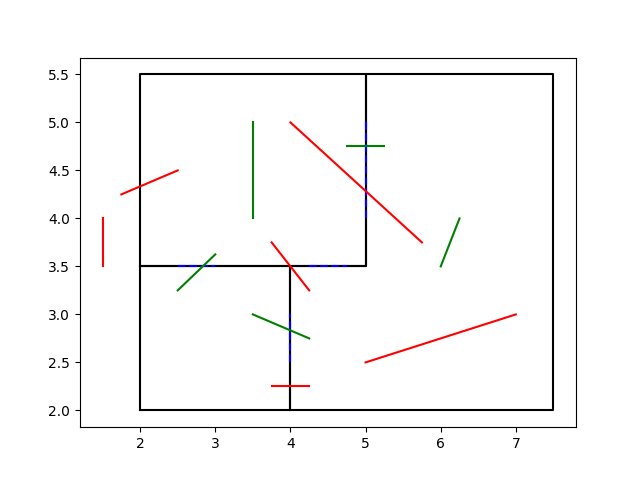

# Polygon Line Validator

Polygon Line Validator is a C++ project that checks if a line segment can pass through a set of polygons without intersecting any of their edges. The project also includes test cases and a Python script for visualizing the results.

## Table of Contents

- [Getting Started](#getting-started)
    - [Prerequisites](#prerequisites)
    - [Installation](#installation)
- [Usage](#usage)
- [File Structure](#file-structure)
- [Testing](#testing)
- [Visualization](#visualization)
- [Contributing](#contributing)
- [License](#license)

## Getting Started

These instructions will help you set up the project on your local machine for development and testing purposes.

### Prerequisites

- A C++ compiler with support for C++11 or later
- CMake (version 3.10 or later)
- Python 3.x (for visualization)

### Installation

1. Clone the repository:

```bash
git clone https://github.com/ozan-git/PolygonLineValidator.git
```

2. Create a build directory and navigate to it:

```bash
cd PolygonLineValidator
mkdir build
cd build
```

3. Run CMake:

```bash
cmake ..
```

4. Build the project:

```bash
cmake --build .
```

## Usage
After building the project, you can run the executable file with the following command:

```bash
./PolygonLineValidator
```

## File Structure

The project is organized into the following structure:
    
    ```
    .
    PolygonLineValidator/
    ├── CMakeLists.txt
    ├── README.md
    │
    ├── src/
    │   ├── main.cpp
    │   │
    │   ├── geometry/
    │   │   ├── LineSegment.cpp
    │   │   ├── LineSegment.h
    │   │   ├── Point.cpp
    │   │   ├── Point.h
    │   │   ├── Polygon.cpp
    │   │   └── Polygon.h
    │   │
    │   └── io/
    │       ├── Operations.cpp
    │       └── Operations.h
    │
    └── test/
    ├── input/
    │   ├── q1_example_input[516].txt
    │   └── q1_input[514].txt
    │
    ├── results/
    │   ├── q1_example_output[512].txt
    │   └── q1_first_output.txt
    │
    └── presentation/
    └── plot_results.py
  
    ```
## Algorithm Explanation

The Polygon Line Validator project uses several algorithms to determine if a line segment can pass through a set of polygons without intersecting any of their edges. The main algorithms are implemented in the following classes:

### Point

The `Point` class represents a 2D point with `x` and `y` coordinates. It provides methods for parsing a point from a string and calculating the distance between two points.

### LineSegment

The `LineSegment` class represents a line segment with a start and end point. It provides a method `doLineSegmentsIntersect` to check if two line segments intersect. This method calculates the intersection point of the two line segments and checks if the intersection point lies within the range of both line segments.

### Polygon

The `Polygon` class represents a polygon with a list of vertices. It provides methods for parsing a polygon from a string, checking if a point is inside a polygon, and checking if a point is on the edge of a polygon. The `isPointInsidePolygon` method uses the ray casting algorithm to determine if a point is inside a polygon by counting the number of intersections between a ray extending from the point and the polygon's edges.

### io Namespace

The `io` namespace contains functions for reading input files, processing test points, and checking if a line segment can pass through a set of polygons without intersecting any of their edges. The `isPassable` function checks if a line segment can pass through the polygons by iterating through all the polygons and checking if the start and end points of the line segment are inside any of the polygons. If the start and end points are not inside any polygons, the function checks if the line segment intersects any of the polygon edges or passages.

The `processTestPoints` function processes the test points by iterating through all the test points and checking if the line segment between the start and end points is passable using the `isPassable` function. The results are written to an output file.

The `processFiles` function reads the input file, processes the test points, and writes the results to the output file.

## Code Explanation

The `plot_results.py` file contains code to visualize the results of a passability test using the visibility graph algorithm. The file reads the input and result files of a passability test, and then visualizes the polygons, passages, and test points using Matplotlib. The result of each test point is shown with a green line if it is passable and a red line if it is not. The input file is assumed to be in the format specified in the assignment.

### Drawing Strategies

The file defines several drawing strategies as subclasses of the `DrawingStrategy` class. Each drawing strategy has a `draw` method that takes an `ax` parameter, which is a Matplotlib axis object. The drawing strategies are:

- `PolygonDrawingStrategy`: Draws a polygon with a black line.
- `PassageDrawingStrategy`: Draws a passage with a blue dashed line.
- `TestPointsDrawingStrategy`: Draws a line between the start and end points of a test point with a green line if it is passable and a red line if it is not.

### Drawing Context

The `DrawingContext` class is responsible for managing the drawing strategies and calling their `draw` methods. It has an `add_strategy` method to add a drawing strategy to the context, and a `draw_all` method to call the `draw` method of each strategy.

### Reading Input and Result Files

The `read_input_file` function reads the input file and returns a tuple containing the polygons, passages, and test points as lists of tuples. Each tuple represents a polygon, passage, or test point, and contains a list of 2D points as tuples.

The `read_result_file` function reads the result file and returns a list of integers representing the passability of each test point. A value of 1 indicates that the test point is passable, and a value of 0 indicates that it is not.

### Main Function

The `main` function reads the input and result files using the `read_input_file` and `read_result_file` functions, respectively. It then creates a `DrawingContext` object and adds drawing strategies for the polygons, passages, and test points. Finally, it creates a Matplotlib figure and axis object, calls the `draw_all` method of the `DrawingContext` object to draw everything, and shows the plot using the `plt.show` function.

The file can be run as a script by checking if `__name__` is equal to `"__main__"`, and calling the `main` function with the input and result file paths.

## Testing

The project includes two test cases, which can be found in the `test/input` directory. The test cases are as follows:

- `q1_example_input[516].txt`: This test case is the example input given in the project description.
- `q1_input[514].txt`: This test case is a more complex input that includes polygons with more than 3 vertices.

The results of the test cases can be found in the `test/results` directory. The results are as follows:

- `q1_example_output[512].txt`: This result is the output of the example input given in the project description.
- `q1_first_output.txt`: This result is the output of the more complex input.
- `Figure_1.png`: This image shows the visualization of example input and results file visualized using the `plot_results.py` script.

Here is the picture of the visualization of the example input and results file:



Here is red line segment that is not passable because it intersects with the polygon edges and passages are shown in color blue.
Passable line segments are shown in color green.

## Visualization

The project includes a Python script for visualizing the results. The script can be found in the `presentation` directory. The script uses the `matplotlib` library for plotting the polygons and the line segment. The script also uses the `shapely` library for checking if the line segment intersects with any of the polygons. The script can be run with the following command:

```bash
python3 plot_results.py
```

## Contributing

Pull requests are welcome. For major changes, please open an issue first to discuss what you would like to change.

## License

This project is licensed under the MIT License. See the [LICENSE](LICENSE) file for details.


 